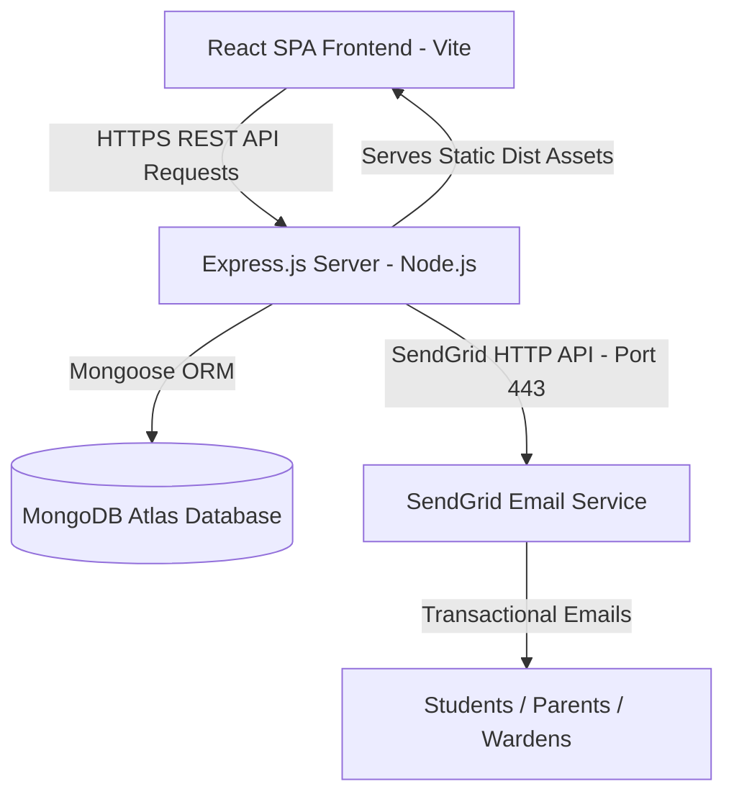
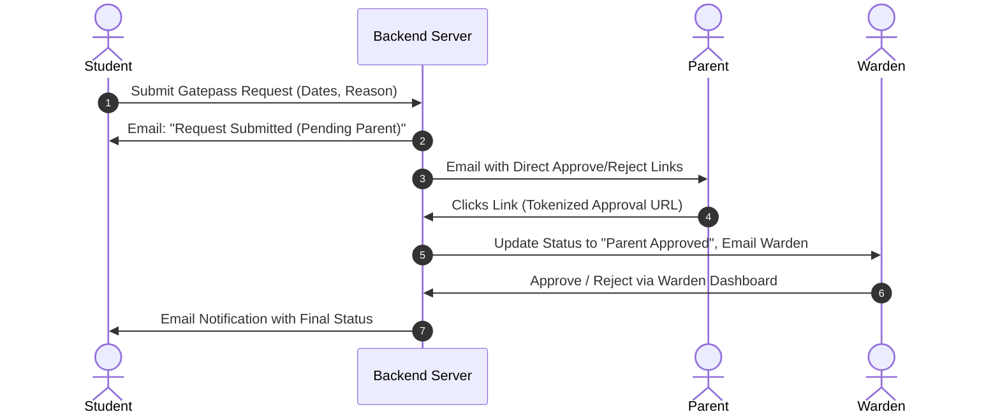

# CampusNest: Full-Stack College & Hostel Management System
## Complete Project Report & Technical Interview Preparation Guide

---

## 1. Project Overview & Elevator Pitch

### 30-Second Elevator Pitch (For Interviewers)
> *"CampusNest is a full-stack MERN-like web application designed to streamline campus administration and hostel operations. It features multi-role access control for Students, Wardens, Teachers, and Librarians, as well as a multi-tier automated Gatepass Approval System involving parents and wardens. Built with React on the frontend, Node.js/Express on the backend, MongoDB Atlas for data persistence, and deployed on Render with SendGrid HTTP API for transactional email notifications (OTP verification, gatepass alerts, fine notices)."*

### Key Highlights
- **Multi-Role RBAC**: 4 primary user roles (`student`, `warden`, `teacher`, `librarian`) + parent interaction layer.
- **2-Factor Email OTP Verification**: Ensures authentic account creation.
- **Asynchronous Gatepass Approval Pipeline**: Student → Email to Parent (Approve/Reject link) → Notification to Warden → Warden Approval → Student Notification.
- **Hostel Room Allotment System**: Real-time room request and approval pipeline.
- **Departmental Fine & Clearance Tracking**: Fines issued by specific departments with email receipts.
- **Full-Stack Deployment on Render**: Single-service deployment serving static React production builds through Express.

---

## 2. Technology Stack & System Architecture

### Technology Breakdown

| Layer | Technology Used | Purpose / Justification |
| :--- | :--- | :--- |
| **Frontend** | React 18 (Vite) | Fast component-based UI rendering, SPA architecture. |
| **Routing & State** | React Router DOM v6, Context / Local Storage | Client-side routing, JWT auth persistence. |
| **HTTP Client** | Axios | Configured with base URL interceptors for JWT Bearer tokens. |
| **Backend Runtime** | Node.js (ES Modules) | Asynchronous non-blocking I/O event loop. |
| **Web Framework** | Express.js v5 | Middleware handling, RESTful routing, static file hosting. |
| **Database** | MongoDB Atlas (Cloud) | Flexible document schema for dynamic nested details (parent/guardian). |
| **ORM / ODM** | Mongoose v8 | Data validation, schema definitions, model relationships, population. |
| **Authentication** | JSON Web Token (JWT), bcryptjs | Stateless auth tokens (7-day expiry), salted password hashing. |
| **Email Service** | SendGrid REST API (`@sendgrid/mail`) | HTTP-based transactional email delivery bypassing SMTP firewalls. |
| **Hosting Platform**| Render Cloud | Unified web service for frontend build delivery & Express API. |

---

## 3. Key Feature Workflows & Systems

### A. Authentication & Registration Workflow
1. **User Signup**: User fills form (Name, Email, Password, Role, Student ID, Parent details).
2. **Password Hashing**: `bcryptjs` salts and hashes password before saving to MongoDB (`isVerified: false`).
3. **OTP Generation**: 6-digit random code generated with a 10-minute expiry window.
4. **Email Dispatch**: `sendOtpEmail()` sends code via SendGrid HTTP API.
5. **Verification**: User inputs OTP; backend checks `user.otp === inputOtp && Date.now() < user.otpExpires`. Upon success, `isVerified = true` and JWT token is issued.

### B. Multi-Tier Automated Gatepass System

---

## 4. Engineering Challenges & Real-World Problem Solving

### Problem 1: Render Cloud Firewall Blocking Nodemailer (SMTP Connection Timeout)
- **Symptom**: When deployed to Render, email sending timed out (`ETIMEDOUT` / `Connection timeout` on ports 587 and 465).
- **Root Cause Analysis**: Free-tier cloud hosting providers (Render, AWS, DigitalOcean) block outbound SMTP ports (25, 465, 587) at the firewall level to prevent automated spam botnets.
- **Initial Fix Attempts**:
  1. *Fixing `SMTP_FROM` header syntax*: Resolved RFC 5322 format errors, but port 465/587 still timed out.
  2. *Resend API*: Worked over HTTPS, but Resend free tier restricts recipient emails solely to the registered account owner, preventing emails to parents/wardens.
- **Final Architectural Solution**: Switched from Nodemailer (SMTP) to **SendGrid HTTP API (`@sendgrid/mail`)**. Because SendGrid sends requests over standard HTTPS (Port 443), it bypasses cloud host SMTP firewall blocks completely while allowing emails to any address.

### Problem 2: Emails Arriving in Spam Folder
- **Reason**: Single Sender Verification was done using `@gmail.com` via SendGrid's IP address. Receiving mail servers (Gmail/Yahoo) perform DMARC/SPF checks. Since SendGrid servers are not listed in Gmail's SPF records, Gmail flags the email as unauthenticated/spoofed.
- **Interview Response**: *"In production, this is solved by purchasing a custom domain (e.g., `campusnest.com`) and configuring CNAME records for DKIM, SPF, and DMARC in DNS settings."*

### Problem 3: CORS & Production Routing in Full-Stack Deployment
- **Approach**: Express serves static assets from `frontend/dist` in production (`app.use(express.static(...))`) and has a catch-all route redirecting non-API traffic to `index.html`. This eliminates CORS issues in production as frontend and backend share the exact same domain (`campusnest-fullstack-f9j0.onrender.com`).

---

## 5. Database Schema & Data Models

### User Model (`models/User.js`)
- `name`, `email` (unique), `password` (hashed)
- `role`: Enum `['student', 'warden', 'teacher', 'librarian']`
- `studentId`, `phone`, `address`
- `parentName`, `parentEmail`, `parentPhone`
- `isVerified` (Boolean), `otp` (String), `otpExpires` (Date)
- `hostelRoom`: ObjectId ref to `HostelRoom`

### Gatepass Model (`models/Gatepass.js`)
- `student`: ObjectId ref to `User`
- `fromDate`, `toDate`, `reason`
- `status`: Enum `['pending_parent', 'approved_by_parent', 'approved_by_warden', 'rejected']`
- `parentApprovalToken`, `rejectionReason`

### Fine Model (`models/Fine.js`)
- `student`: ObjectId ref to `User`
- `department`: Enum `['hostel', 'library', 'academic']`
- `amount`, `reason`, `status`: Enum `['unpaid', 'paid']`

---

## 6. Top 15 Interview Questions & Answers

### Q1: Can you walk me through the architecture of your application?
**Answer:**
> *"The application follows a full-stack MVC pattern. The frontend is a React SPA powered by Vite, utilizing Axios for API communication and React Router for client-side navigation. The backend is built with Node.js and Express, following RESTful principles. MongoDB Atlas serves as the database, managed via Mongoose models. Authentication is stateless using JWTs and bcryptjs password hashing. For transactional emails, we use SendGrid’s REST API over HTTPS to ensure high deliverability without hitting host firewall restrictions."*

### Q2: Why did you switch from Nodemailer to SendGrid?
**Answer:**
> *"Nodemailer relies on traditional SMTP protocols over ports 465 or 587. When deploying to cloud environments like Render's free tier, outbound traffic on SMTP ports is blocked at the infrastructure level to prevent spam. This caused socket connection timeouts (`ETIMEDOUT`). SendGrid solves this by providing a Node.js SDK that communicates via HTTP/HTTPS API calls on Port 443, which is never blocked by cloud firewalls."*

### Q3: Why do transactional emails from `@gmail.com` go to the Spam folder when sent via SendGrid?
**Answer:**
> *"This occurs due to email authentication protocols—specifically SPF, DKIM, and DMARC. When SendGrid sends an email with a `From: user@gmail.com` header, the receiving inbox checks Google's SPF records. Since SendGrid's IP address isn't listed in Google's official SPF record, the receiving email provider suspects domain spoofing and routes the message to Spam. To achieve inbox placement in production, one must use a custom domain with verified CNAME/TXT records for DKIM and SPF."*

### Q4: How is security handled for passwords and authentication?
**Answer:**
> *"Passwords are never stored in plain text. Before saving a user model, `bcryptjs` generates a salt and hashes the password. During login, `bcrypt.compare()` verifies the entered password against the stored hash. Upon validation, the server generates a JSON Web Token (JWT) signed with a secret key (`JWT_SECRET`) and a 7-day expiration. Subsequent protected requests attach this token in the `Authorization: Bearer <token>` header, which custom Express middleware verifies before granting access."*

### Q5: How does the Role-Based Access Control (RBAC) work in your app?
**Answer:**
> *"In MongoDB, every user document contains a `role` string field constrained to `['student', 'warden', 'teacher', 'librarian']`. On the backend, authorization middleware decodes the JWT, fetches the user's role, and compares it against allowed roles for that specific endpoint. On the frontend, React Router handles route protection by redirecting users to their role-specific dashboards (`/student/dashboard`, `/warden/dashboard`, etc.)."*

### Q6: How does the parent gatepass approval link work without requiring parent login?
**Answer:**
> *"When a student requests a gatepass, the system generates a unique security token attached to the gatepass document in MongoDB. The backend constructs approval and rejection links containing this token (`/api/gatepass/parent-approve/:token`). When the parent clicks the link in their email, the endpoint validates the token, updates the gatepass status to `approved_by_parent`, and triggers a notification email to the warden. This provides a frictionless user experience while remaining secure."*

### Q7: How do you serve both frontend and backend on Render?
**Answer:**
> *"During build time, Vite compiles the React code into optimized static files inside `frontend/dist`. In `server.js`, Express checks if `process.env.NODE_ENV === 'production'`. If true, it serves static files using `express.static(path.join(__dirname, '../frontend/dist'))` and uses a wildcard fallback route (`app.use('*', ...)` to return `index.html`. This allows client-side React routing to function seamlessly on a single domain."*

### Q8: What happens if a user signs up but doesn't enter an OTP?
**Answer:**
> *"During signup, the user document is created with `isVerified: false`, along with a 6-digit OTP string and an `otpExpires` timestamp set to `Date.now() + 10 mins`. If the user attempts to log in before verifying, the login controller checks `!user.isVerified` and rejects the attempt with a 401 status code instructing them to verify first. Unverified accounts can be purged periodically using a TTL index or scheduled cleanup script."*

### Q9: How do you handle database connections efficiently in Node.js?
**Answer:**
> *"We use Mongoose's connection pooling mechanism. Rather than opening and closing a new connection for every API request, `mongoose.connect(process.env.MONGODB_URI)` establishes an initial connection pool when the server starts. Express reuses these pooled connections across incoming requests, minimizing connection overhead and improving throughput."*

### Q10: How do you handle errors in asynchronous Express routes?
**Answer:**
> *"All controller logic is wrapped in `try...catch` blocks. If an exception occurs (e.g., database network error or invalid payload), the `catch` block logs the full error server-side and sends a structured JSON response with an appropriate HTTP status code (`400 Bad Request`, `401 Unauthorized`, `404 Not Found`, or `500 Internal Server Error`) along with a user-friendly error message."*

### Q11: What is the purpose of Axios interceptors in your frontend?
**Answer:**
> *"We created a centralized Axios instance in `src/utils/api.js`. A request interceptor automatically attaches the `Authorization: Bearer <token>` header from `localStorage` to every outgoing request. A response interceptor checks for `401 Unauthorized` responses—if a token has expired or is invalid, it clears `localStorage` and redirects the user to the `/login` route."*

### Q12: How would you scale this application if the student base grows to 100,000 users?
**Answer:**
> 1. **Database**: Implement database indexing on frequently queried fields (`email`, `studentId`, `status`), read-replicas, and MongoDB sharding.
> 2. **Caching**: Use Redis to cache user sessions, dashboard stats, and room allotment states to reduce MongoDB query load.
> 3. **Background Job Queues**: Move email dispatching out of the HTTP request-response cycle into a background worker queue (e.g., BullMQ with Redis) so API calls return instantly.
> 4. **Microservices / Decoupling**: Separate static frontend hosting (CDN/Vercel) from backend API services on auto-scaling containers (Kubernetes/AWS ECS).

### Q13: Why did you choose MongoDB over a Relational Database like PostgreSQL?
**Answer:**
> *"MongoDB's document model fits complex, hierarchical domain objects like User profiles (which contain dynamic sub-objects for parent and guardian contact details) and Gatepass requests. It allows fast iteration without rigid table migrations during early development. However, for strict transactional features like financial payments, Mongoose transactions or a relational DB could also be used."*

### Q14: How do environment variables work across environments (Local vs Render)?
**Answer:**
> *"In local development, the `dotenv` package reads key-value pairs from a `.env` file into `process.env`. On Render, environment variables (`MONGODB_URI`, `JWT_SECRET`, `SENDGRID_API_KEY`, `SMTP_FROM`) are securely injected into the runtime environment via Render's dashboard dashboard environment settings, keeping sensitive credentials out of git repositories."*

### Q15: What was the hardest bug you solved during this project?
**Answer:**
> *"The hardest bug was diagnosing why emails were silently failing after deploying to Render. Initially, Nodemailer worked locally with Gmail SMTP, but timed out on Render due to Render's firewall blocking outbound SMTP ports 587 and 465. Furthermore, testing alternative APIs like Resend revealed domain restrictions for free tiers. By researching cloud firewall rules and API protocols, I refactored the email architecture to use SendGrid's HTTPS REST API and configured Single Sender Verification, restoring full email functionality."*

---

## 7. Quick Flashcards for Revision

- **Frontend Stack**: React 18, Vite, React Router DOM, Axios.
- **Backend Stack**: Node.js, Express.js, Mongoose, MongoDB Atlas.
- **Auth**: JWT (7 days), bcryptjs (salt rounds = 10).
- **Email Tech**: SendGrid REST API (`@sendgrid/mail`) via Port 443 (HTTPS).
- **Gatepass Statuses**: `pending_parent` ➔ `approved_by_parent` ➔ `approved_by_warden` (or `rejected`).
- **Render Setup**: Combined build serving static files from `frontend/dist`.
